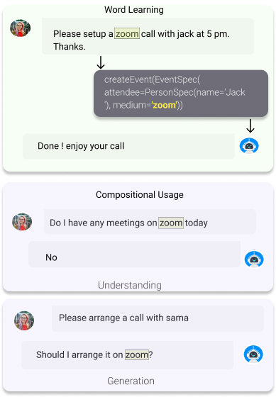

# On the Compositional Word Learning Abilities of Neural Sequence Models

Humans can rapidly acquire new words and use them compositionally in sentences. It is therefore important to understand the novel word learning abilities of models designed for language processing. Previous works on word acquisition in models either focus on developing task-specific approaches or are limited in their scope of the evaluation. In this work, we focus on analysing the general word learning abilities of widely-used neural sequence models such as LSTMs and Transformers. We evaluate by the means of extrinsic evaluation, i.e., whether the model is able to understand and use the word compositionally in varying contexts. We first test word learning on existing compositional generalization benchmarks. Then, motivated by the need for deeper analysis, we create a new synthetic benchmark called Alchemy-WL that has systematic splits between the train and test sets to enable robust evaluation of the word learning abilities of models. We evaluate and compare the performance of models along multiple dimensions such as accuracy of generation, type of novel word, and amount of evidence provided. Our findings shed light on the strength of inductive biases of these models while highlighting the need to develop generally applicable approaches for novel word learning in the wild.


<p align="center">
  
</p>

## Dependencies
- compatible with Python 3.6+
- ./requirements.txt

## Instructions to run the code
1. Clone the repository
    ```
    git clone https://github.com/tejasvaidhyadev/AlchemyWL.git
    cd AlchemyWL
    ```
2. ALCHEMY-WL dataset generation
    ```
    cd data_generation
    python generate_data.py
    ```
3. check lstm adn transformer folders for training and evaluation scripts

## License
This code is released under the MIT License (refer to the LICENSE file for details).


